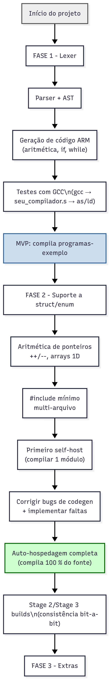

# compilador-C-ARMv4-32bits

mycc/
├── Makefile
├── README.md
├── include/
│   ├── token.h          # enum TokenKind, struct Token, prototypes do lexer
│   └── stubs.h          # protótipos manuais: malloc, printf, etc.
├── src/
│   ├── common/
│   │   ├── arena.c  arena.h   # alocador de arena
│   │   └── util.c   util.h    # helpers (string view, array dyn…)
│   ├── lexer/
│   │   ├── lexer.c  lexer.h   # `Token *tokenize(const char *src)`
│   │   └── keywords.inc       # tabela gerada/estática de palavras‑chave
│   ├── parser/
│   │   ├── parser.c parser.h
│   │   ├── ast.c ast.h        # Node estrutura + factory helpers
│   │   └── prec_table.inc     # precedência dos operadores
│   ├── sema/
│   │   ├── sema.c  sema.h     # análise semântica mínima
│   ├── code_generator/
│   │   ├── code_generator.c code_generator.h
│   └── main.c                 # parse flags, orquestra fases
├── samples/
│   ├── fib.c
│   └── sorts.c
└── tests/
    ├── lexer/
    ├── parser/
    ├── sema/
    └── code_gen/         # arquivos de teste do gerador de código



```
./prog; echo $? |

---

### 5 ▪ Checklist de “mínimo para rodar”

- [ ] Lexer reconhece todos tokens necessários (`return`, `int`, `char`, `;`, `{`, `}`, `(`, `)`, `+ - * / == != <= >= < > = , &`).
- [ ] Suporte a literais inteiros (`123`, `0xFF`) e char (`'a'`, `'\n'`).
- [ ] Parser entende declarações `int x;`, `int f(int) { … }` e corpo com `if/while/for/return`.
- [ ] Geração de prólogo/epílogo fixo: `stmfd sp!, {fp, lr}` / `ldmfd sp!, {fp, pc}`.
- [ ] Alocação de no máximo 4 registradores ao mesmo tempo; spill simples (push/pop em SP) se precisar.
- [ ] Emitir `.global main`, `.text`, `.data` se houver globais.
- [ ] Script de teste que compila ➜ monta ➜ linka ➜ executa ➜ compara saída.

Cumprindo todo o checklist você termina a **Fase 1** com um compilador “toy”, mas já capaz de gerar `.s` ARM para programas de referência. A partir daí fica muito mais fácil estender para structs/enums e partir para a auto-hospedagem na **Fase 2**. Boa codificação!

```